PathLinker Cytoscape
====================

Welcome to the documentation for the PathLinker Cytoscape App.

Helpful links:
- [PathLinker app on the Cytoscape App Store](http://apps.cytoscape.org/apps/pathlinker)
- [PathLinker-Cytoscape GitHub repository](https://github.com/Murali-group/PathLinker-Cytoscape)
- [PathLinker Cytoscape Automation example Jupyter Notebook](http://nbviewer.jupyter.org/github/Murali-group/PathLinker-Cytoscape/blob/master/cytoscape-automation-example/jupyter_notebook_example.ipynb)

## Description

This app implements the PathLinker algorithm for reconstructing signalling pathways from protein interaction networks2.

## Overview

PathLinker is a method for reconstructing signalling pathways from protein interaction and regulatory networks. Consider a protein-protein interaction network represented as a directed graph. The network may contain physical, signalling, and regulatory interactions between pairs of proteins. Given a query composed of a set of receptors and a set of transcription factors in this network that represent the "sources" and "targets" of some specific signalling pathway (e.g., the Wnt pathway), PathLinker attempts to compute a high quality reconstruction of this pathway. Specifically, PathLinker computes a sub-network that connects the receptors in the query to the transcription factors in the query. More generally, PathLinker will be useful for connecting any set of sources to any set of targets in an interaction network.

The primary algorithmic component of PathLinker is computing the _k_-shortest simple paths in the network from any source to any target. PathLinker accomplishes this task through a novel integration of Yen's algorithm with the A* heuristic, which allows very efficient computation for very large _k_ values, e.g., 10,000, on networks with hundreds of thousands of edges. PathLinker outputs the sub-network composed of the _k_ shortest paths.

PathLinker supports several different options for weighting the edges in the network. If the edges in the input graph do not have weights, PathLinker computes the _k_ lowest cost paths, where the cost of a path is the number of edges in it. If the input graph has edge weights, they can be treated additively or as probabilities. If the edge weights are additive, PathLinker defines the cost of a path as the sum of the edge weights and computes the _k_ paths of lowest cost. In the case of probabilities, PathLinker treats the edge weights as multiplicative and computes the _k_ highest cost paths, where the cost of a path is the product of the edge weights.

See the publications referenced below for a formal description of the method, comprehensive evaluations and comparisons to other approaches, and experimental validation of results.

## Running the App
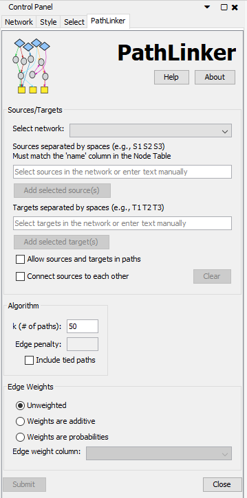

To run the app, fill in the inputs (as described below) and press the submit button. Required inputs: 1) a selected network, 2) at least 1 source and target, 3) a value for k.

## Inputs
### Network
PathLinker runs on the currently selected network. The _Select network_ dropdown box shows the available networks in Cytoscape and can be used to select a network.  

### Sources/Targets
The user can select nodes directly from the network and then use the buttons 'Add selected sources' and 'Add selected targets' to add the selected nodes names to the corresponding text field. Node names can also be entered manually, separated by spaces, but they must match the 'name' column of the Node table. If there are sources or targets named that do not exist in the network, PathLinker will warn the user. 

There are two options available options here:

* **Allow sources and targets in paths**: Normally, PathLinker removes incoming edges to sources and outgoing edges from targets before computing paths. If the user selects this option, PathLinker will not remove these edges. Therefore, source and target nodes can appear as intermediate nodes in paths computed by PathLinker.

* **Connect sources to each other**: If the user selects this option, PathLinker will copy the sources to the targets field. This option allows the user to compute a sub-network of paths connecting any of the sources/targets to each other. If the user selects this option, then PathLinker will automatically allow sources and targets to appear in paths, i.e., the previous option is also selected. Note that since PathLinker computes loopless paths, if the user inputs only a single node and selects this option, PathLinker will not compute any paths at all.

### Algorithm 
There are three parameters here:

* **_k_**: PathLinker takes in the number of paths the user wants. If an invalid value is input for _k_ (e.g., a negative number or a non-integer), PathLinker will compute the default _k_ = 200 paths.
* **Edge penalty**: PathLinker can apply an edge penalty when using the additive or multiplicative edge weight options. The larger the value of edge penalty, the less likely it is that longer paths will appear in the results before low-weight shorter paths.
    * **Weights are additive**: penalize each path (i.e. add to the total path score) by a factor of (number of edges in the path)*(edge penalty). Default is 0. Numbers > 0 are allowed.
    * **Weights are probabilities**: penalize each path (i.e. add to the total path score) by a factor of (number of edges in the path)^(edge penalty). Default is 1. Numbers >= 1 are allowed.
* **Include tied paths**: If this option is selected, PathLinker will output the *k* lowest cost paths, as well as all paths "tied" (i.e., equal path cost) with the _kth_ path.

### Edge weights 
There are three options for the edge weights:

* **Unweighted**: PathLinker will compute the _k_ lowest cost paths, where the cost is the number of edges in the path
* **Weights are additive**: PathLinker will compute the _k_ lowest cost paths, where the cost is the sum of the edge weights
* **Weights are probabilities**: PathLinker will compute the _k_ highest cost paths, where the cost is the product of the edge weights

When a weighted option is selected, the user must select which column to use as the edge weight using `Edge weight column` drop-down. All columns in the `Edge Table` that are of the type `Double`, `Integer`, `Float`, and `Long` can be selected.

## Outputs
PathLinker generates three outputs:

1. **PathLinker-results-X-k-paths**: A sub-network consisting of the nodes and edges involved in the _k_ paths.
2. **PathLinker Results X**: A results panel that displays a table of the rank, score, and nodes of the _k_ paths.
    * Selecting one or more paths in results table will select or highlight those paths in the sub-network.
    * The results can be exported to a TSV (tab separated file).
    * All three of these outputs can be deleted using the Discard button. 
3. **Path Rank X**: A column in the Edge Table whose value is the rank of the first path in which a given edge appears.

## Example
Here I go through an example of how to load a network, run PathLinker on it using a set of sources and targets, and look at the results.

### Load Network
To load a network, go to file->import->network->from file. In this example, I downloaded the [protein-protein interactome](http://bioinformatics.cs.vt.edu/~murali/supplements/2016-sys-bio-applications-pathlinker/downloads/background-interactome-pathlinker-2015.txt) used by Ritz _et al._ [2] from here: <http://bioinformatics.cs.vt.edu/~murali/supplements/2016-sys-bio-applications-pathlinker/>.  

[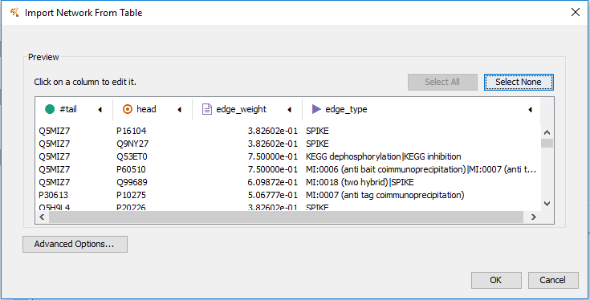](_static/img/import-network.png)

Specify the source and target columns (tail and head columns). Note that Cytoscape assumes the edges are directed, which they are in our case.

I don't know about you, but I don't think using gene names not UniProt IDs! Fortunately cytoscape has various methods to add different namespaces such as gene symbols for uniprot IDs. One easy way is to right click on the top of a column and use the "Map column" tool. 
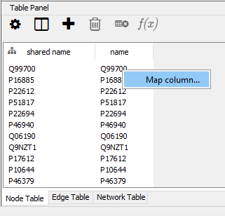
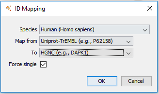

This has options to automatically map from uniprot to HGNC (Gene Symbol). The screenshots below show the results of the mapping.

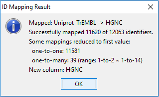
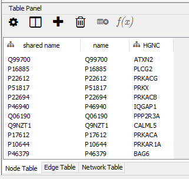

### Sources and Targets
PathLinker computes the _k_ shortest or highest scoring paths from a set of sources to a set of targets in an underlying network. In our app paper ([The PathLinker app: Connect the dots in protein interaction networks](https://f1000research.com/articles/6-58/v1)) as an example use case for PathLinker, we use the receptors and TFs perturbed by drug lovastatin in the ToxCast dataset as the sources and targets.
In the ToxCast data, lovastatin perturbed three receptors (EGFR, KDR and TEK) and five TFs (MTF1, NFE2L2, POU2F1, SMAD1 and SREBF1). Because our network uses UniProt IDs as the name of the node, we have to use the UniProt IDs which are: P35968 P00533 Q02763 and Q15797 Q14872 Q16236 P14859 P36956.

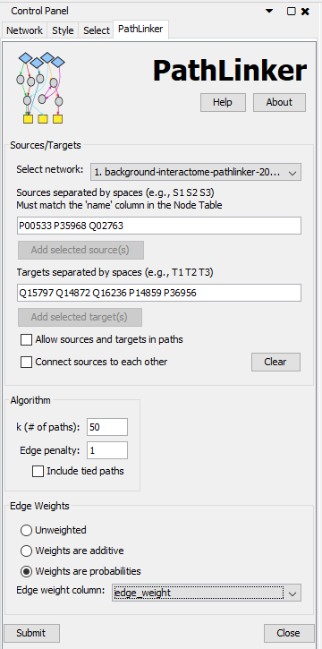

#### Select Sources and Targets from Network
If you have a network view open, instead of manually typing node names into the sources and targets field, you can select nodes from the network and use the "Add selected source(s)" and "Add selected target(s)" buttons to enter the sources and targets.
Below I have screenshots of selecting and adding the EGFR and TEK nodes to the sources field, and NFE2L2 and SMAD1 to the targets field. Notice the UniProt IDs are added because, those are the IDs in the 'name' column of the Node table.

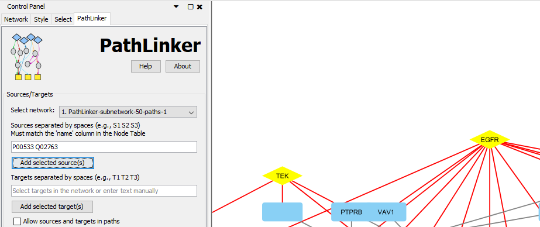
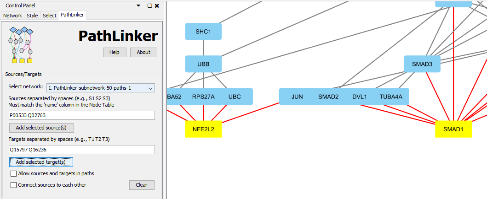

#### Allow sources and targets in paths
Normally PathLinker removes all incoming edges to sources and outgoing edges to targets. If you want to allow sources and targets to also be intermediate nodes along source->target paths, select this option. 
Also, if a user wants to include nodes as both a source and a target, this option should be selected, otherwise all incoming and outgoing edges to the nodes in both will be removed.

#### Connect sources to each other
In some cases, a user may want to find paths or build a subnetwork connecting a set of nodes to each other where any node can be a source and any can be a target. 
Using the "Connect sources to each other" option will copy the sources to the targets field, select the "Allow sources and targets in paths" option, and disable the targets text field. 

In the example below, I actually wanted to connect the lovastatin targets to each other, so I copied them to the sources field.

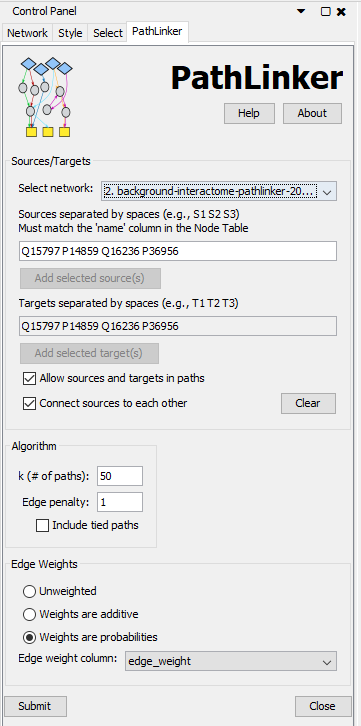

Here is the resulting subnetwork with the first couple of paths highlighted.

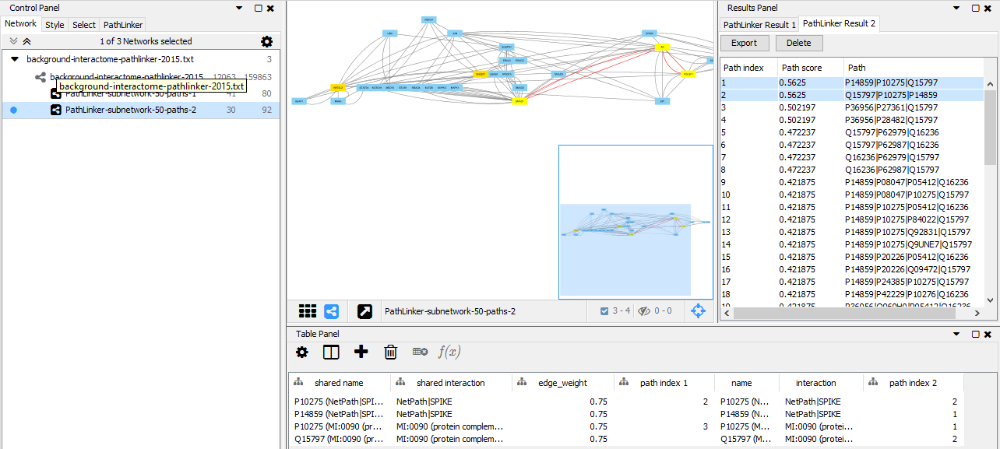

### Edge weight options
The interactome we imported also has probabilities for edge weights corresponding to the likelihood an interaction is real. We want PathLinker to use those weights, so select the "Weights are probabilites" option, and the "edge_weight" column. PathLinker transforms the probabilities where higher is better into a cost where lower is better by taking the -log (base 10) of the weight. 
The total cost of a path found by PathLinker is the sum of the -log transformed weights. That cost is transformed back into a score by taking ecost which is equivalent to taking the product of the edge weights. The higher the path score, the better.

If your network has weights or costs were lower is better, use the "Weights are additive option". No transformation is necessary there.

### Results
PathLinker will run after clicking submit and generate 3 outputs:
1. A subnetwork containing the _k_ paths. The app will apply the hierarchical layout if < 2000 paths are in the results. 
2. An interactive results table showing the paths along with the index of each path and the score of each path. 
3. A _path index X_ column in the edge table whose value is the index of the first path in which a given edge appears.
[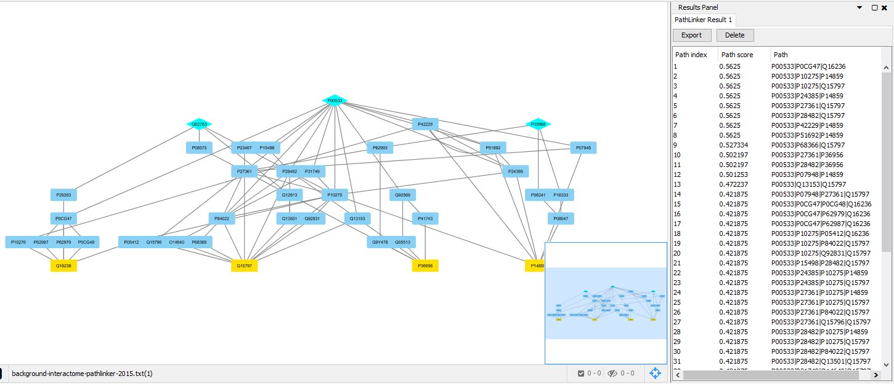](_static/img/lovastatin-results.png)
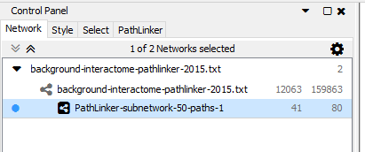
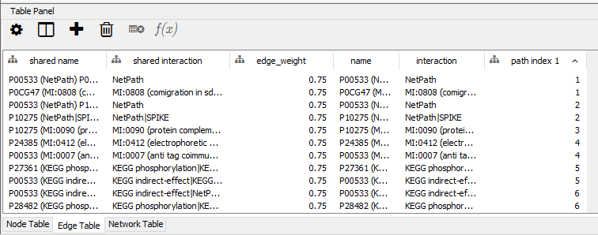

To change the network to show gene names, go to the Style tab in the Control Panel and change the label to HGNC.
[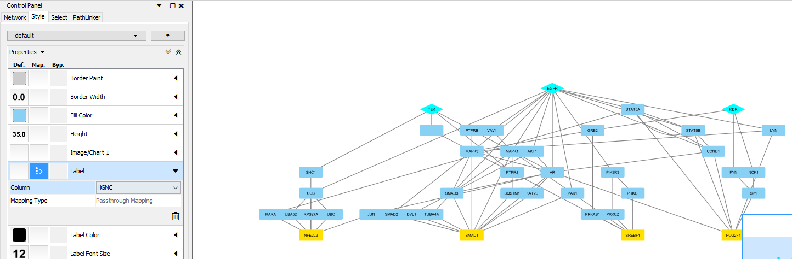](_static/img/lovastatin-results-gene.png)

You can select rows in the results table to highlight/select the corresponding nodes and edges in the network.
[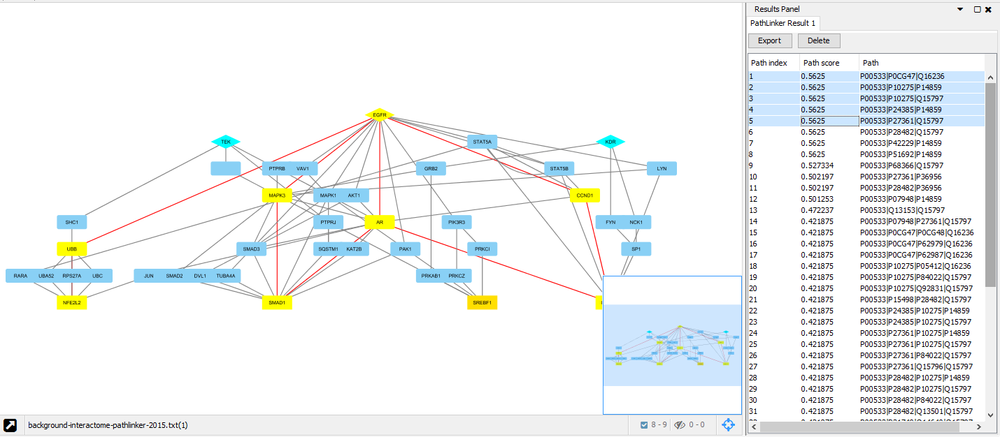](_static/img/lovastatin-results-highlight-2.png)

Click the export button to save the table to a tab-separated file. Paths are represented as nodes in order of the path with a vertical bar '|' between them

If you have PathLinker results you want to discard, use the _delete_ button in the results panel. The app will try to delete all three outputs it generated with the selected Result Panel tab.
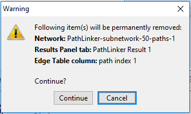

### Edge penalty
#### Weights are Additive 
If you have a large distribution of edge weights and some edges with very small costs (close to 0), your results could have many source->target paths that are very long (have many small-cost edges).
Including an edge penalty would add the given penalty to each edge weight, which effectively penalizes each path (i.e. add to the total path score) by a factor of (number of edges in the path)*(edge penalty). Default is 0 (no penalty) and numbers > 0 are allowed. 
#### Weights are Probabilities
If your weights are probabilites and many are close to 1, they can become very small when taking the -log to transform to costs. This could lead to source->target paths that are very long (have many edges). 
To favor shorter paths with less edges, you can add an edge penalty which penalizes each path (i.e. add to the total path score) by a factor of (number of edges in the path)^(edge penalty). Default is 1 (no penalty) and numbers >= 1 are allowed.

### Include tied paths
Often paths can have the same score as other paths because the edges in them have the same weight. 
If there are multiple paths with the same score as the _kth_ path, normally PathLinker ignores this and shows only up to _k_ paths.
To include all paths with the same weight as the _kth_ path, use the "Include tied paths" option.

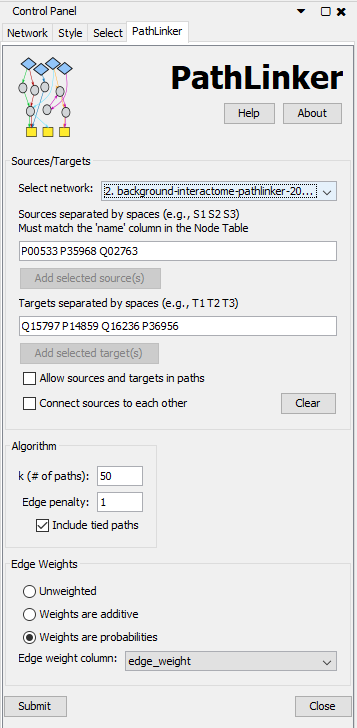

In our example, including all paths for the set of receptors and TFs for lovastatin with an input k of 50 gives a total of 236 paths.

[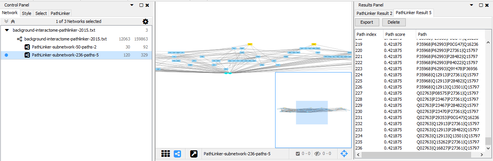](_static/img/include-tied-paths-results.png)

## Errors and Warnings
Here I go over some example errors and warnings you may run into. 

### Sources or Targets not in network
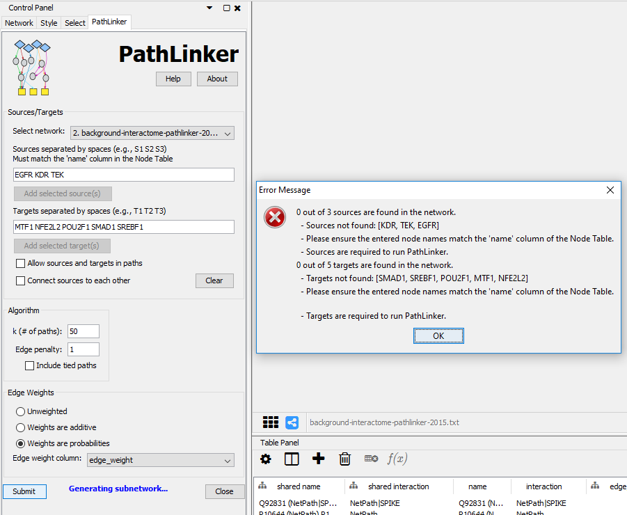

If you're getting an error that sources or targets are not found in the network, make sure you're using the right names for the nodes. 
PathLinker uses the 'name' column of the node table which contains UniProt IDs, so the gene names are not found.

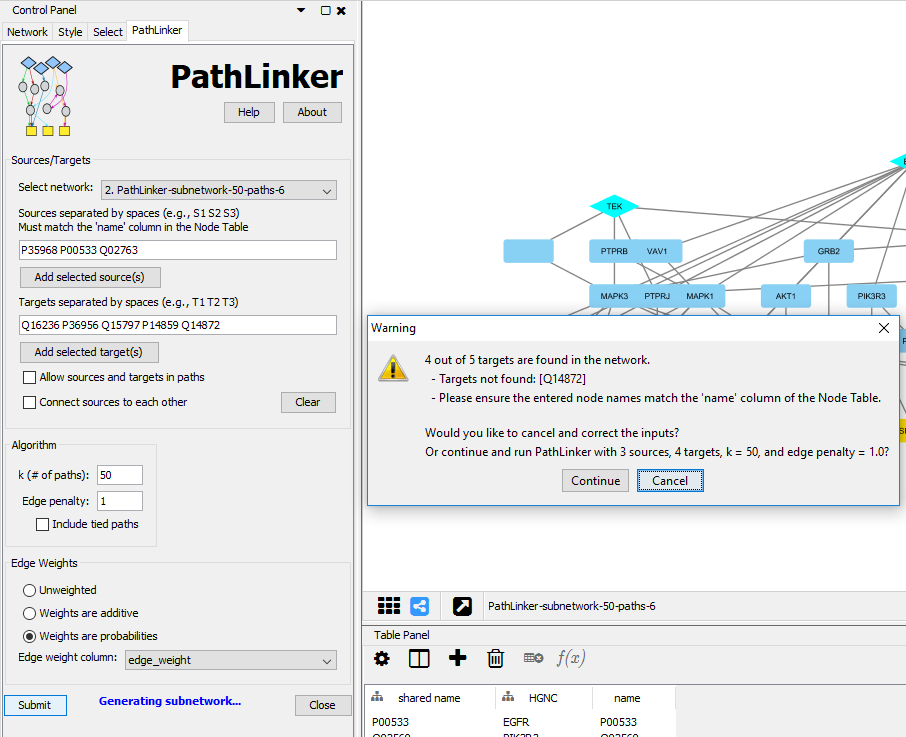

Another problem you could run into is all of your sources and targets may have been in the original network, but if you don't re-select the original network when running the app a second time, then PathLinker will use the subnetwork. 

It could be that not all of the sources and targets you entered were used in the top _k_ paths. In the screenshot, only 4 of the 5 targets were in the top 50 paths. In this case, you can continue and run PathLinker using the sources and targets that are in the current network.

### Invalid input for parameters
**_k_** only takes positive integers and the **Edge penalty** only takes positive floats. 

### Not all edges have weight
In order for PathLinker to work properly, all edges must have weights when using a weighted option. You can either fix the empty edge weight rows, add a column by uploding another file with edge weights, or just use the unweighted option.

## Cytoscape Automation / cyREST API

We added cyREST API functionality to the PathLinker app! Cytoscape automation is a new feature as of Cytoscape 3.6. Check out our [example jupyter notebook](https://github.com/Murali-group/PathLinker-Cytoscape/tree/master/cytoscape-automation-example/jupyter_notebook_example.ipynb) to see how to use it. More details coming soon.

## How to Cite PathLinker

We will be very glad to hear from you if you use PathLinker in your work. If you publish a paper that uses PathLinker, please cite:

1. [The PathLinker app: Connect the dots in protein interaction networks](https://f1000research.com/articles/6-58/v1). Daniel Gil, Jeffrey Law, Li Huang and T. M. Murali. F1000Research 2017, 6:58 
2. [Pathways on Demand: Automated Reconstruction of Human Signaling Networks](http://www.nature.com/articles/npjsba20162). Anna Ritz, Christopher L. Poirel, Allison N. Tegge, Nicholas Sharp, Allison Powell, Kelsey Simmons, Shiv D. Kale, and T. M. Murali, Systems Biology and Applications, a Nature partner journal, 2, Article number 16002, 2016. 

## Contact Information

If you have any problems using PathLinker or any suggestions for improvement, please contact us by email at jeffl@vt.edu or murali@cs.vt.edu
